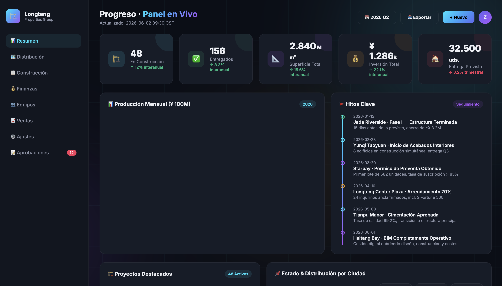
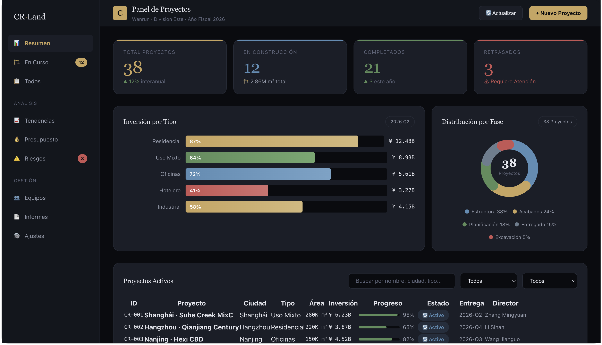

# skills-123

<h3 align="center"><em>The Skill Proxy — Sin instalar. Usar directamente.</em></h3>

<p align="center">
  
  
  
</p>

<p align="center">
  <strong>Uno produce dos, dos produce tres, tres produce todas las cosas.</strong><br>
  — Tao Te Ching
</p>

<p align="center">
  <strong>Pides construir algo. skills-123 busca skills comunitarias en GitHub,<br>
  lee su conocimiento y lo inyecta en contexto — mejor resultado, sin instalar nada.</strong><br>
  <sup>Chino · English · 日本語 · 한국어 · Español — intención, no palabras clave.</sup>
</p>

<p align="center">
  🌐 <a href="README.md">English</a> | <a href="README.zh.md">简体中文</a> | <a href="README.ja.md">日本語</a> | <a href="README.ko.md">한국어</a>
</p>

---

## ✨ En 30 segundos

skills-123 es un **meta-skill** — una skill que usa otras skills.

```
Tú: "Construye un panel de control para proyectos inmobiliarios"
          │
          ▼
┌─────────────────────────────────────────────────────┐
│  🤖 skills-123 — El Skill Proxy                      │
│                                                      │
│  🔎 DESCUBRIR   Buscar skills relevantes en GitHub   │
│  📖 LEER        Leer el SKILL.md de las mejores      │
│  💉 INYECTAR    Extraer patrones y mejores prácticas  │
│  ✅ ENTREGAR    Completar la tarea con más calidad    │
└─────────────────────────────────────────────────────┘
          │
          ▼
Un dashboard profesional y distintivo — no IA genérica.
(Opcional: "¿Instalar esta skill para el futuro?")
```

---

## 🎯 ¿Por qué "Skill Proxy"?

| Modelo tradicional | skills-123 |
|---|---|
| Buscas → evalúas → instalas → usas | Pides → skills-123 proxy del conocimiento |
| Skills ocupan disco, se cargan siempre | Solo fragmentos relevantes, bajo demanda |
| Debes saber qué skills existen | Descubrimiento automático |
| Solo palabras clave en inglés | 5 idiomas, por **intención de tarea** |

---

## 📂 Comparación

| Prompt | Sin skills-123 | Con skills-123 |
|--------|:---:|:---:|
| [`example/es/prompt.md`](example/es/prompt.md) | [](example/es/output-without-skill.html) | [](example/es/output-with-skill.html) |
| *"Construye un panel inmobiliario"* | Degradado púrpura · Inter · Chart.js CDN | Dorado · Layout empresarial · Gráficos CSS |

> Otros idiomas: [English](example/en/output-with-skill.html) · [简体中文](example/zh/output-with-skill.html) · [日本語](example/ja/output-with-skill.html) · [한국어](example/ko/output-with-skill.html)

---

## 🚀 Instalación

```bash
curl -sL https://raw.githubusercontent.com/jasonanewcoder/skills-123/main/install.sh | bash
# O manual
git clone https://github.com/jasonanewcoder/skills-123.git
cd skills-123 && bash install.sh
```

Reinicia Claude Code. `skills-123` estará activo.

| Agent | Guía | |
|-------|------|:---:|
| **Claude Code** | *(integrado)* | ✅ |
| **OpenAI Codex** | [codex.md](docs/codex.md) | ✅ |
| **Cursor** | [cursor.md](docs/cursor.md) | ⚠️ |
| **Coze (扣子)** | [coze.md](docs/coze.md) | ✅ |

---

## 🛡️ Seguridad · 📄 Licencia

Puntuación 5D (comunidad·actualidad·autor·relevancia·seguridad). 22 patrones críticos rechazados.

**jasonanewcoder, Claude Code, DeepSeek** · MIT — [LICENSE](LICENSE)
