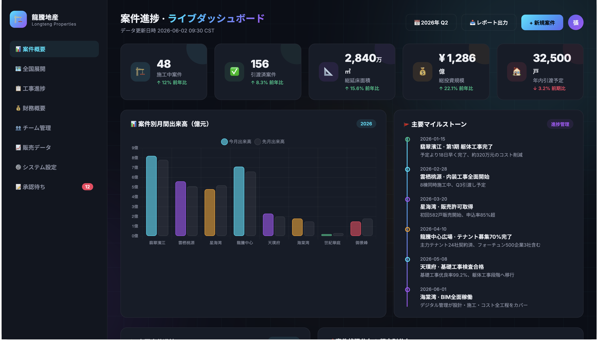
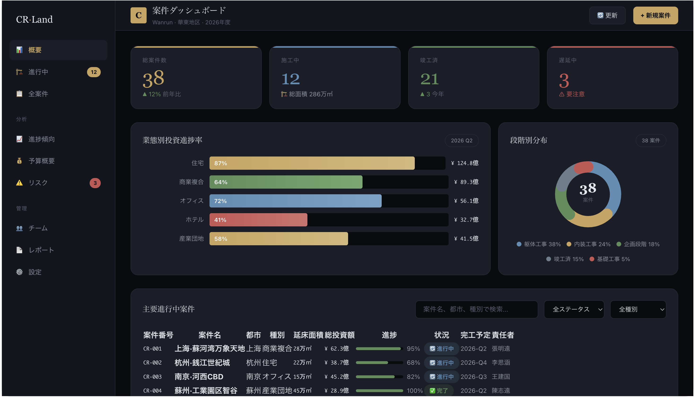

# skills-123

<h3 align="center"><em>The Skill Proxy — インストール不要。そのまま使える。</em></h3>

<p align="center">
  
  
  
</p>

<p align="center">
  <strong>一は二を生み、二は三を生み、三は万物を生む</strong><br>
  — 老子
</p>

<p align="center">
  <strong>あなたが「作って」と言えば、skills-123 が GitHub からコミュニティスキルを発見し、<br>
  知識を読み取り、コンテキストに注入——より良い結果を、何もインストールせずに。</strong><br>
  <sup>中国語 · English · 日本語 · 한국어 · Español — トリガーワードではなく意図で判断。</sup>
</p>

<p align="center">
  🌐 <a href="README.md">English</a> | <a href="README.zh.md">简体中文</a> | <a href="README.ko.md">한국어</a> | <a href="README.es.md">Español</a>
</p>

---

## ✨ 30秒で理解

skills-123 は **メタスキル**——スキルを使うためのスキルです。

```
あなた：「不動産プロジェクト管理のダッシュボードを作って」
          │
          ▼
┌─────────────────────────────────────────────────────┐
│  🤖 skills-123 — スキルプロキシ                      │
│                                                      │
│  🔎 発見   GitHub で関連スキルを検索                 │
│  📖 取得   上位スキルの SKILL.md を直接読む           │
│  💉 注入   パターン・ベストプラクティスを抽出         │
│  ✅ 提供   コミュニティ知識を反映してタスクを完了     │
└─────────────────────────────────────────────────────┘
          │
          ▼
汎用AI出力ではない、プロ品質のダッシュボードが完成。
（オプション：「このスキルをインストールしますか？」）
```

---

## 🎯 「スキルプロキシ」とは？

| 従来のスキルモデル | skills-123 |
|---|---|
| ユーザーが検索→評価→インストール→使用 | ユーザーが依頼→skills-123 が知識をプロキシ |
| スキルはディスクに保存、毎回読み込み | 必要な断片だけをオンデマンドで注入 |
| どんなスキルがあるか知っている必要がある | 自動発見 |
| 英語トリガーワードのみ | 5言語、**タスクの意図**で判断 |

---

## 📂 効果の比較

| Prompt | skills-123 なし | skills-123 あり |
|--------|:---:|:---:|
| [`example/ja/prompt.md`](example/ja/prompt.md) | [](example/ja/output-without-skill.html) | [](example/ja/output-with-skill.html) |
| *「不動産プロジェクト管理のダッシュボードを作って」* | 紫グラデ · Interフォント · Chart.js CDN | ゴールド系 · エンタープライズ · CSSチャート |

> 他言語: [English](example/en/output-with-skill.html) · [简体中文](example/zh/output-with-skill.html) · [한국어](example/ko/output-with-skill.html) · [Español](example/es/output-with-skill.html)

---

## 🚀 インストール

```bash
curl -sL https://raw.githubusercontent.com/jasonanewcoder/skills-123/main/install.sh | bash
# または
git clone https://github.com/jasonanewcoder/skills-123.git
cd skills-123 && bash install.sh
```

Claude Code を再起動。`skills-123` が有効に。

| Agent | ガイド | |
|-------|------|:---:|
| **Claude Code** | *(内蔵)* | ✅ |
| **OpenAI Codex** | [codex.md](docs/codex.md) | ✅ |
| **Cursor** | [cursor.md](docs/cursor.md) | ⚠️ |
| **Coze（扣子）** | [coze.md](docs/coze.md) | ✅ |

---

## 🛡️ セキュリティ · 📄 ライセンス

5次元スコア（コミュニティ·最新性·作者·関連性·安全性）。22の重大パターン自動拒否。

**jasonanewcoder, Claude Code, DeepSeek** · MIT — [LICENSE](LICENSE)
