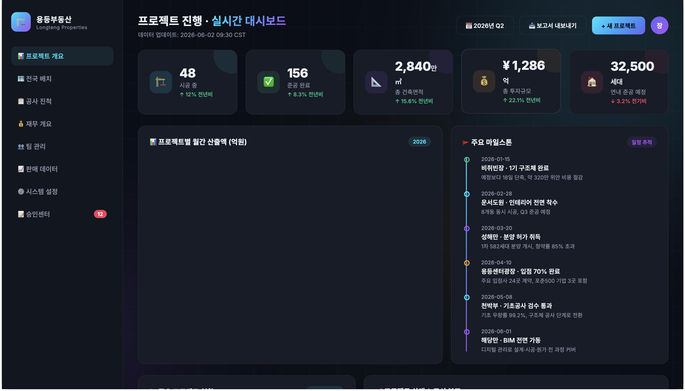
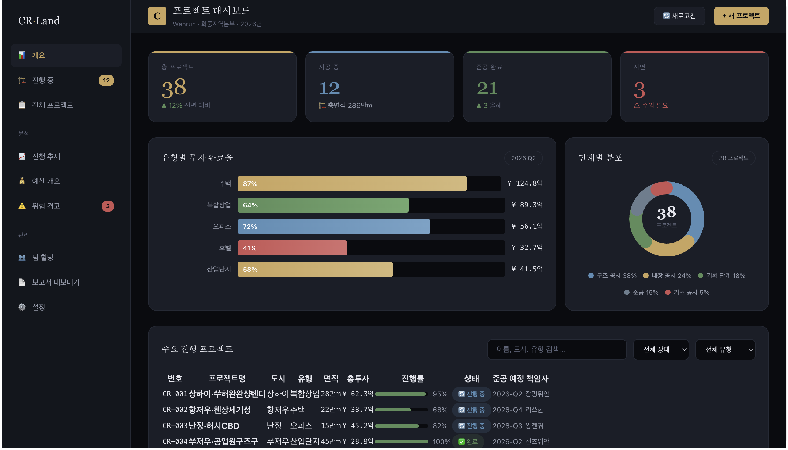

# skills-123

<h3 align="center"><em>The Skill Proxy — 설치 없이 바로 사용.</em></h3>

<p align="center">
  
  
  
</p>

<p align="center">
  <strong>하나가 둘을 낳고, 둘이 셋을 낳고, 셋이 만물을 낳는다</strong><br>
  — 노자
</p>

<p align="center">
  <strong>무언가를 만들어 달라고 하면, skills-123이 GitHub에서 커뮤니티 스킬을 찾아<br>
  지식을 읽고 컨텍스트에 주입——더 나은 결과를, 아무것도 설치하지 않고.</strong><br>
  <sup>중국어 · English · 日本語 · 한국어 · Español — 트리거 단어가 아닌 의도로 판단.</sup>
</p>

<p align="center">
  🌐 <a href="README.md">English</a> | <a href="README.zh.md">简体中文</a> | <a href="README.ja.md">日本語</a> | <a href="README.es.md">Español</a>
</p>

---

## ✨ 30초 요약

skills-123은 **메타 스킬**——스킬을 사용하는 스킬입니다.

```
당신: "부동산 프로젝트 관리 대시보드를 만들어 줘"
          │
          ▼
┌─────────────────────────────────────────────────────┐
│  🤖 skills-123 — 스킬 프록시                          │
│                                                      │
│  🔎 발견   GitHub에서 관련 스킬 검색                 │
│  📖 읽기   상위 스킬의 SKILL.md 직접 읽기             │
│  💉 주입   패턴·모범 사례·도메인 지식 추출            │
│  ✅ 제공   커뮤니티 지식을 반영해 작업 완료           │
└─────────────────────────────────────────────────────┘
          │
          ▼
일반적인 AI 출력이 아닌 독창적인 대시보드 완성.
(선택사항: "이 스킬 설치할까요?")
```

---

## 🎯 「스킬 프록시」란?

| 기존 스킬 모델 | skills-123 |
|---|---|
| 사용자가 검색→평가→설치→사용 | 사용자가 요청→skills-123이 지식을 프록시 |
| 스킬이 디스크에 저장, 매번 로드 | 필요한 부분만 온디맨드로 주입 |
| 어떤 스킬이 있는지 알아야 함 | 자동 발견 |
| 영어 트리거 단어만 | 5개 언어, **작업 의도**로 판단 |

---

## 📂 효과 비교

| Prompt | skills-123 없음 | skills-123 있음 |
|--------|:---:|:---:|
| [`example/ko/prompt.md`](example/ko/prompt.md) | [](example/ko/output-without-skill.html) | [](example/ko/output-with-skill.html) |
| *"대시보드를 만들어 줘"* | 보라 그라데이션 · Inter 폰트 · Chart.js CDN | 골드 계열 · 엔터프라이즈 · CSS 차트 |

> 다른 언어: [English](example/en/output-with-skill.html) · [简体中文](example/zh/output-with-skill.html) · [日本語](example/ja/output-with-skill.html) · [Español](example/es/output-with-skill.html)

---

## 🚀 설치

```bash
# 설치（npx — 권장）
npx skills add jasonanewcoder/skills-123

# 또는 curl
curl -sL https://raw.githubusercontent.com/jasonanewcoder/skills-123/main/install.sh | bash

# 또는 git clone
git clone https://github.com/jasonanewcoder/skills-123.git
cd skills-123 && bash install.sh
```

Claude Code 재시작. `skills-123` 활성화.

| Agent | 가이드 | |
|-------|------|:---:|
| **Claude Code** | *(내장)* | ✅ |
| **OpenAI Codex** | [codex.md](docs/codex.md) | ✅ |
| **Cursor** | [cursor.md](docs/cursor.md) | ⚠️ |
| **Coze（扣子）** | [coze.md](docs/coze.md) | ✅ |

---

## 🛡️ 보안 · 📄 라이선스

5차원 평가（커뮤니티·최신성·작성자·관련성·보안）. 22개 심각 패턴 자동 거부.

**jasonanewcoder, Codex, ChatGPT, Claude Code, DeepSeek** · MIT — [LICENSE](LICENSE)
