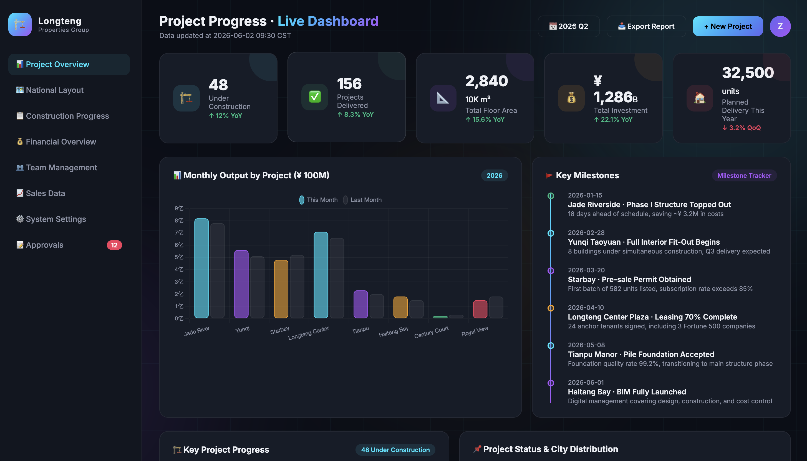
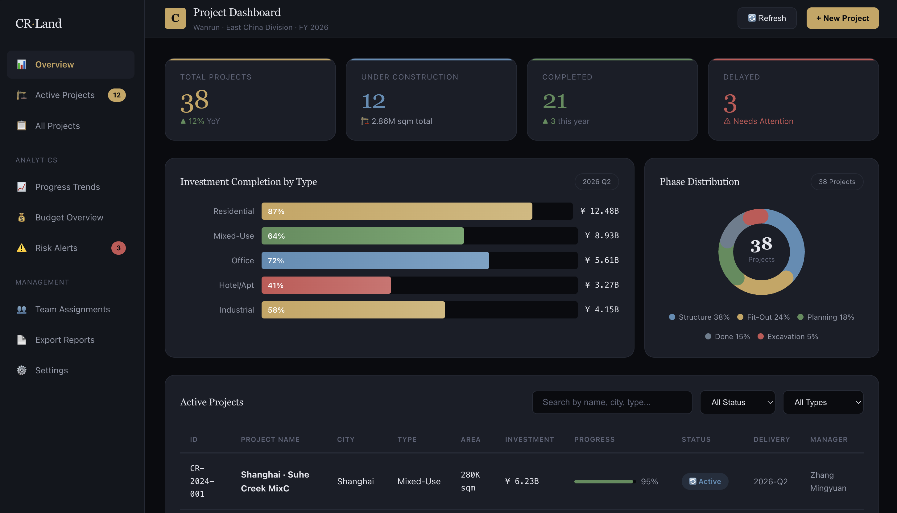

# skills-123

<h3 align="center"><em>The Skill Proxy — Discover, Inject, Improve. No Install Needed.</em></h3>

<p align="center">
  
  
  
  
</p>

<p align="center">
  <strong>一生二，二生三，三生万物</strong><br>
  <em>One produces two, two produces three, three produces all things.</em><br>
  — Tao Te Ching, Chapter 42
</p>

<p align="center">
  <strong>You ask. skills-123 finds community skills on GitHub, reads their knowledge,<br>
  and injects it into context — so you get better output without installing anything.</strong><br>
  <sup>Chinese · English · Japanese · Korean · Spanish — task intent, not trigger words.</sup>
</p>

<p align="center">
  🌐 <a href="README.zh.md">简体中文</a> | <a href="README.ja.md">日本語</a> | <a href="README.ko.md">한국어</a> | <a href="README.es.md">Español</a>
</p>

---

## ✨ The 30-Second Pitch

skills-123 is a **meta-skill** — a skill that uses other skills. Here's what happens:

```
You: "Help me build a dashboard for tracking real estate projects"
          │
          ▼
┌─────────────────────────────────────────────────────┐
│  🤖 skills-123 — The Skill Proxy                     │
│                                                      │
│  🔎 DISCOVER   Search GitHub for relevant skills     │  "dashboard UI skill" → 3 parallel queries
│  📖 FETCH      Read the best SKILL.md files directly │  Raw GitHub content, no clone needed
│  💉 INJECT     Extract patterns, best practices,     │  Anti-AI-slop · design systems · templates
│                domain expertise                      │
│  ✅ DELIVER    Complete your task — now with         │  Higher quality, zero extra steps
│                community knowledge baked in          │
└─────────────────────────────────────────────────────┘
          │
          ▼
You get a distinctive, enterprise-grade dashboard.
(Optional: "Want me to install that skill for next time?")
```

**That's it.** No browsing GitHub. No reading SKILL.md files yourself. No installing things you might never use again. Just ask for what you want, and skills-123 makes it better.

---

## 🎯 Why "The Skill Proxy"?

| Traditional skill model | skills-123 |
|---|---|
| You find skills → evaluate them → install them → use them | You ask → skills-123 proxies the knowledge to you |
| Skills sit on your disk, loaded into every session | Only relevant fragments enter your context, on-demand |
| Must know what skills exist | Discovery is automatic |
| English-only trigger words | 5 languages, judged by **task intent** |

**skills-123 inverts the relationship:** skills work for you, not the other way around. Like a proxy server sits between you and the internet, skills-123 sits between you and GitHub's skill ecosystem — fetching exactly what you need, exactly when you need it.

---

## 📂 Proof: Same Prompt, With vs. Without

| Prompt | Without skills-123 | With skills-123 |
|--------|:---:|:---:|
| [`example/en/prompt.md`](example/en/prompt.md) | [](example/en/output-without-skill.html) | [](example/en/output-with-skill.html) |
| *"Build me a dashboard for real estate"* | Purple glow · Inter font · Chart.js CDN · looks AI-generated | Gold accents · enterprise layout · CSS-only charts · distinctive |

**Without skills-123:** you get whatever the base model generates — usually the same purple-glow, Inter-font, Chart.js-dependent "AI aesthetic" everyone else gets.

**With skills-123:** community design patterns, anti-slop principles, and domain expertise are injected before the model writes a single line.

> See all 5 languages: [简体中文](example/zh/output-with-skill.html) · [日本語](example/ja/output-with-skill.html) · [한국어](example/ko/output-with-skill.html) · [Español](example/es/output-with-skill.html)

---

## 🚀 Quick Start

```bash
# Install (npx — recommended)
npx skills add jasonanewcoder/skills-123

# Or via curl
curl -sL https://raw.githubusercontent.com/jasonanewcoder/skills-123/main/install.sh | bash

# Or via git clone
git clone https://github.com/jasonanewcoder/skills-123.git
cd skills-123 && bash install.sh

# Restart Claude Code, then just ask:
"帮我写一个dashboard网页"
"Build me a project tracker"
"不動産の管理画面を作って"
```

skills-123 activates automatically when it detects you want to build something. No trigger words. No configuration.

### Other agents

| Agent | Guide | |
|-------|-------|:---:|
| **Claude Code** | *(built-in)* | ✅ |
| **OpenAI Codex** | [codex.md](docs/codex.md) | ✅ |
| **Cursor** | [cursor.md](docs/cursor.md) | ⚠️ |
| **Coze (扣子)** | [coze.md](docs/coze.md) | ✅ |
| **Windsurf** | [windsurf.md](docs/windsurf.md) | ✅ |
| **Gemini CLI** | [gemini-cli.md](docs/gemini-cli.md) | ✅ |
| **OpenCode** | [opencode.md](docs/opencode.md) | ✅ |
| **Aider** | [aider.md](docs/aider.md) | ⚠️ |
| **VSCode / Copilot** | [vscode.md](docs/vscode.md) | ⚠️ |

---

## 💬 Usage

### Proxy Mode — Default, Automatic

Just talk normally. skills-123 detects task intent in any language and activates:

```
"帮我写一个酷炫的dashboard网页"       → finds dashboard/UI skills
"Build me a project tracker"          → finds project management skills
"不動産の管理画面を作って"              → finds dashboard + real estate skills
"대시보드 만들어 줘"                  → finds visualization skills
"Construye un panel inmobiliario"     → finds real estate + UI skills
```

### Install Mode — When You Want to Keep One

```
"Find me skills for Kubernetes deployment"
"Install that dashboard skill from earlier"
"Search for PostgreSQL backup skills"
```

### Power Users: Guaranteed Triggering via Hook

The default trigger depends on the model reading the skill description and deciding to invoke it. For **guaranteed triggering**, configure a `PreToolUse` hook that fires before every file write:

```json
// .claude/settings.local.json (project-level)
{
  "hooks": {
    "PreToolUse": [{
      "matcher": "Write|Edit",
      "hooks": [{
        "type": "command",
        "command": "echo '[skills-123 guard] Have you searched for community skills?'"
      }]
    }]
  }
}
```

This bypasses the model's trigger decision — the system reminds the model before any file write to search first. Full documentation and tuning options: [`references/hook-config.md`](skills/skills-123/references/hook-config.md)

---

## 🛡️ Safety

Every skill found gets scanned before use or install:

```
Skill found → Scan content
                  │
      ┌───────────┼───────────┐
      ▼           ▼           ▼
   ✅ Clean    ⚠️ Warning   🚫 Critical
   Use it      Flag first   Auto-reject
```

| Signal | Weight | |
|--------|:------:|---|
| **Community** | 0–15 | Stars (log scale) |
| **Recency** | 0–10 | Updated ≤3mo = 10 |
| **Author Trust** | 0–15 | Verified org · known publisher · contributors |
| **Relevance** | 0–30 | Keyword match vs. your query |
| **Security** | 0–20 | Clean = 20 · warnings = 10 · **critical = -1** |

**22 critical patterns** auto-rejected (`curl | sh`, `eval $`, `rm -rf /`, reverse shells…). **18 warning patterns** flagged for review.

---

## 🏗️ Project Layout

```
skills-123/
├── skills/
│   └── skills-123/SKILL.md          🤖 The Skill Proxy (Proxy + Install modes)
│       ├── scripts/                 Search · evaluate · install · security scan
│       ├── references/              Scoring rubric · safety patterns · sources
│       └── cache/                   (auto-created)
├── example/                         📂 Before/after in 5 languages
│   ├── zh/ en/ ja/ ko/ es/          Prompt + both outputs
│   └── screenshots/                 10 PNG comparisons
├── docs/                            Per-agent install guides
├── install.sh                       One-command installer
├── CLAUDE.md                        Project behavior
└── LICENSE                          MIT
```

---

## 🔬 Compared

| | skills-123 | find-skills | superskillret |
|:---|:---:|:---:|:---:|
| **Form** | Native skill (in-chat) | npm CLI | Daemon (~1.4 GB) |
| **Deps** | **curl + git only** | Node.js | Python + ONNX |
| **How it triggers** | **Automatic — task intent** | Manual CLI | Every prompt |
| **Proxy mode** | ✅ (read skills directly) | ❌ | ❌ |
| **Languages** | **5** | 1 | 1 |
| **Security scan** | **22 critical + 18 warn** | None | None |
| **Scoring** | 5-dimension, transparent | None | Cosine (black-box) |

> find-skills is a search bar. superskillret is a heavy recommender. **skills-123 is your skill proxy — it finds, fetches, and injects community knowledge so you don't have to.**

---

## 👥 Authors · 📄 License

**jasonanewcoder, Claude Code, DeepSeek** · MIT — [LICENSE](LICENSE)
