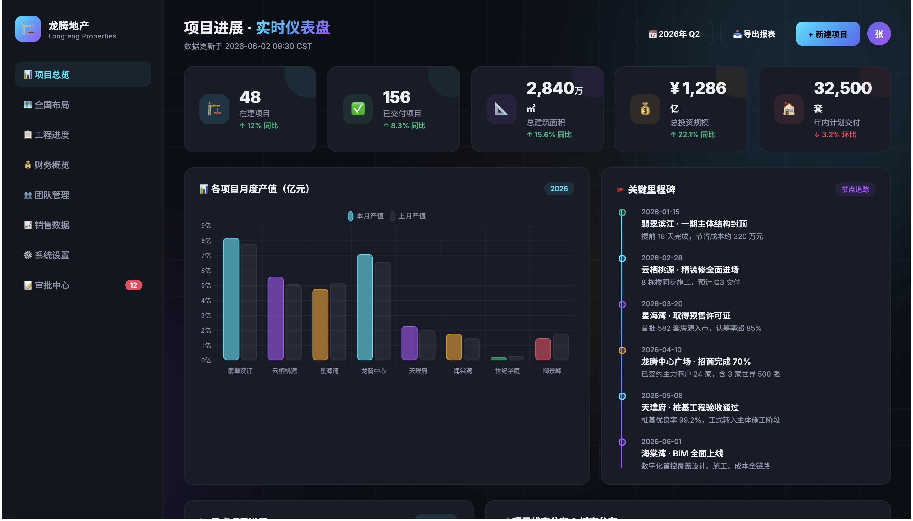
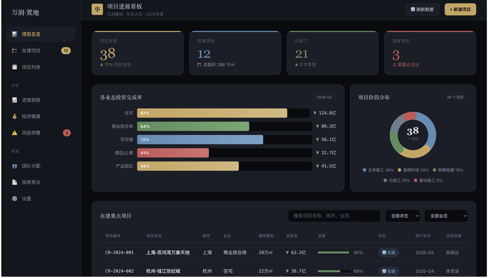

# skills-123（一二三）

<h3 align="center"><em>The Skill Proxy — 不用装，直接用。</em></h3>

<p align="center">
  
  
  
</p>

<p align="center">
  <strong>一生二，二生三，三生万物</strong><br>
  — 道德经·第四十二章
</p>

<p align="center">
  <strong>你说要做什么，skills-123 自动去 GitHub 找社区技能，<br>
  读到它的知识，注入上下文——你拿到更好的结果，什么都不用装。</strong><br>
  <sup>中文 · English · 日本語 · 한국어 · Español — 判断语义意图，不靠触发词。</sup>
</p>

<p align="center">
  🌐 <a href="README.md">English</a> | <a href="README.ja.md">日本語</a> | <a href="README.ko.md">한국어</a> | <a href="README.es.md">Español</a>
</p>

---

## ✨ 30 秒搞懂

skills-123 是一个 **元技能**（meta-skill）——用技能来使用技能。流程如下：

```
你：「帮我做一个房地产项目进度的 dashboard」
          │
          ▼
┌─────────────────────────────────────────────────────┐
│  🤖 skills-123 — 技能代理                            │
│                                                      │
│  🔎 发现  在 GitHub 上搜索相关技能                   │  3 路并行 WebSearch
│  📖 抓取  直接读取排名靠前技能的 SKILL.md             │  WebFetch，无需 clone
│  💉 注入  提取设计模式、最佳实践、领域知识            │  反 AI 审美 · 设计系统 · 模板
│  ✅ 交付  带着社区知识完成你的任务                    │  更高的质量，零额外步骤
└─────────────────────────────────────────────────────┘
          │
          ▼
你获得一个有辨识度的企业级 dashboard。
（可选：「要我把这个 skill 装上，以后用吗？」）
```

**就是这样。** 不用翻 GitHub，不用自己读 SKILL.md，不用装一堆可能再也不会用的东西。说什么就做什么，skills-123 让它更好。

---

## 🎯 什么叫「技能代理」？

| 传统技能模式 | skills-123 |
|---|---|
| 你找技能 → 评估 → 安装 → 使用 | 你说 → skills-123 把知识代理过来 |
| 技能躺在硬盘里，每次对话都加载 | 按需注入相关片段，不占上下文 |
| 你必须知道有哪些技能 | 自动发现 |
| 英文触发词 | 5 种语言，按**任务意图**判断 |

**skills-123 颠倒了关系：** 技能为你服务，而不是你为技能服务。就像代理服务器帮你中转网络请求，skills-123 帮你中转 GitHub 上的技能知识——在需要的时候，把需要的东西，带给你。

---

## 📂 眼见为实：同一个 Prompt，有 vs 没有

| Prompt | 无 skills-123 | 有 skills-123 |
|--------|:---:|:---:|
| [`example/zh/prompt.md`](example/zh/prompt.md) | [](example/zh/output-without-skill.html) | [](example/zh/output-with-skill.html) |
| *"帮我写一个酷炫的dashboard网页"* | 紫色光晕 · Inter 字体 · Chart.js CDN · AI 审美 | 金色系 · 企业布局 · CSS 图表 · 有辨识度 |

**不用 skills-123：** 模型给什么就是什么——通常是千篇一律的紫色光晕 + Inter 字体 + Chart.js 的"AI 脸"。

**用了 skills-123：** 社区的设计规范、反同质化经验、领域知识，在模型动手写代码之前已经注入。

> 其他语言： [English](example/en/output-with-skill.html) · [日本語](example/ja/output-with-skill.html) · [한국어](example/ko/output-with-skill.html) · [Español](example/es/output-with-skill.html)

---

## 🚀 快速开始

```bash
# 安装（npx — 推荐）
npx skills add jasonanewcoder/skills-123

# 或通过 curl
curl -sL https://raw.githubusercontent.com/jasonanewcoder/skills-123/main/install.sh | bash

# 或通过 git clone
git clone https://github.com/jasonanewcoder/skills-123.git
cd skills-123 && bash install.sh

# 重启 Claude Code，然后直接说：
"帮我写一个dashboard网页"
"Build me a project tracker"
"不動産の管理画面を作って"
```

skills-123 自动检测任务意图。不用触发词，不用配置。

### 🇨🇳 中国大陆用户必读

由于 GitHub 在国内访问受限（`raw.githubusercontent.com` 被墙、`github.com` 限速），**强烈建议配置网络环境**，否则几乎所有搜索和获取都会失败：

```bash
# 最简单的方式：在 ~/.bashrc 或 ~/.zshrc 中添加
export CHINA_MODE=1

# 如果你有本地代理（Clash/V2Ray/Shadowsocks）
export https_proxy="http://127.0.0.1:7890"

# 推荐：设置 GitHub Token 获得更高 API 限额（5000次/小时 vs 60次/小时）
export GITHUB_TOKEN="ghp_xxxxxxxxxxxx"
```

**CHINA_MODE=1 做了什么？**
- `raw.githubusercontent.com` → 自动尝试 `raw.ghproxy.com` 等国内可访问的镜像站
- `api.github.com` → 自动尝试 API 镜像站
- DuckDuckGo 搜索 → 自动切换到必应（Bing，国内可访问）
- `git clone` → 通过镜像加速下载

配置后重启终端，然后验证连通性：
```bash
bash ~/.claude/skills/skills-123/scripts/fetch-local.sh check
```

详细说明见 [china-network.md](skills/skills-123/references/china-network.md)。

### 其他 Agent

| Agent | 指南 | 支持 |
|-------|------|:---:|
| **Claude Code** | *(内置)* | ✅ |
| **OpenAI Codex** | [codex.md](docs/codex.md) | ✅ |
| **Cursor** | [cursor.md](docs/cursor.md) | ⚠️ |
| **Coze（扣子）** | [coze.md](docs/coze.md) | ✅ |
| **Windsurf** | [windsurf.md](docs/windsurf.md) | ✅ |
| **Gemini CLI** | [gemini-cli.md](docs/gemini-cli.md) | ✅ |
| **OpenCode** | [opencode.md](docs/opencode.md) | ✅ |
| **Aider** | [aider.md](docs/aider.md) | ⚠️ |
| **VSCode / Copilot** | [vscode.md](docs/vscode.md) | ⚠️ |

---

## 💬 用法

### Proxy 模式——默认，全自动

正常说话就行。skills-123 自动检测任何语言中的任务意图：

```
"帮我写一个酷炫的dashboard网页"       → 搜索 dashboard/UI 技能
"Build me a project tracker"          → 搜索项目管理技能
"不動産の管理画面を作って"              → 搜索 dashboard + 房地产技能
"대시보드 만들어 줘"                  → 搜索可视化技能
"Construye un panel inmobiliario"     → 搜索房地产 + UI 技能
```

### Install 模式——想把技能留下来用

```
"帮我找 Kubernetes 部署相关的技能"
"把刚才那个 dashboard 技能装上"
"搜索 PostgreSQL 备份的 skill"
```

---

## 🛡️ 安全

每个技能使用或安装前都会扫描：

```
发现技能 → 扫描内容
                │
    ┌───────────┼───────────┐
    ▼           ▼           ▼
 ✅ 干净     ⚠️ 有警告    🚫 致命
 直接用      先标记      自动拒绝
```

| 维度 | 权重 | 标准 |
|------|:----:|------|
| **社区** | 0–15 | 星数（对数尺度） |
| **时效** | 0–10 | ≤3 月 = 10 分 |
| **作者信任** | 0–15 | 认证组织 · 知名发布者 · 贡献者数 |
| **相关度** | 0–30 | 关键词匹配率 |
| **安全** | 0–20 | 干净 = 20 · 警告 = 10 · **致命 = -1** |

**22 种致命模式**自动拒绝（`curl | sh`、`eval $`、`rm -rf /`、反弹 Shell…）。**18 种警告模式**标记审查。

---

## 🏗️ 项目结构

```
skills-123/
├── skills/
│   ├── skills-123/SKILL.md          🤖 技能代理（Proxy + Install 双模式）
│   │   ├── scripts/                 搜索 · 评估 · 安装 · 安全扫描
│   │   ├── references/              评分体系 · 安全模式 · 搜索源
│   │   └── cache/                   （自动创建）
├── example/                         📂 5 种语言的效果对比
│   ├── zh/ en/ ja/ ko/ es/          Prompt + 两个输出
│   └── screenshots/                 10 张对比截图
├── docs/                            各平台安装指南
├── install.sh                       一键安装
├── CLAUDE.md                        项目行为引导
└── LICENSE                          MIT
```

---

## 🔬 对比

| | skills-123 | find-skills | superskillret |
|:---|:---:|:---:|:---:|
| **形态** | 原生技能（对话内） | npm CLI | 守护进程 (~1.4 GB) |
| **依赖** | **curl + git 而已** | Node.js | Python + ONNX |
| **触发** | **自动——任务意图** | 手动 CLI | 每次 prompt |
| **Proxy 模式** | ✅（直接读技能） | ❌ | ❌ |
| **语言** | **5** | 1 | 1 |
| **安全扫描** | **22 致命 + 18 警告** | 无 | 无 |
| **评分** | 5 维透明 | 无 | 余弦相似度（黑盒） |

> find-skills 是个搜索框，superskillret 是个重型推荐器。**skills-123 是你的技能代理——发现、抓取、注入社区知识，你什么都不用管。**

---

## 👥 作者 · 📄 许可证

**jasonanewcoder, Claude Code, DeepSeek** · MIT — [LICENSE](LICENSE)
